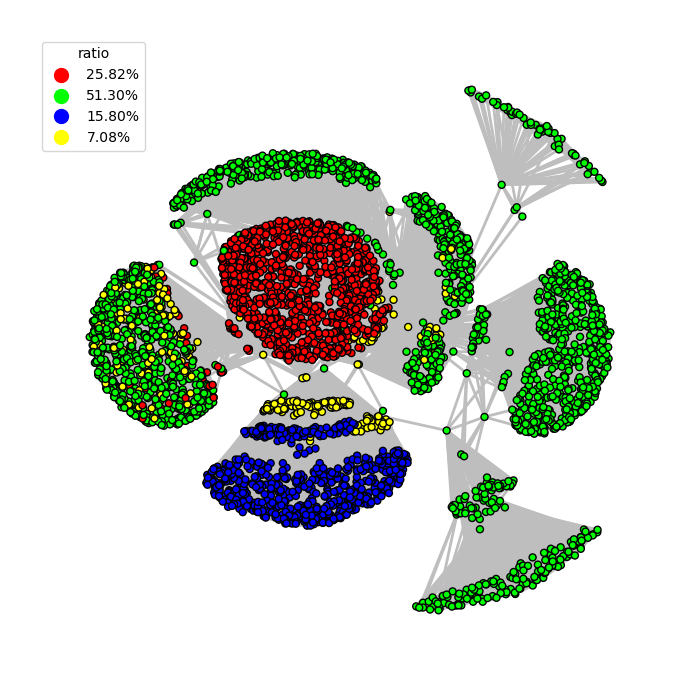
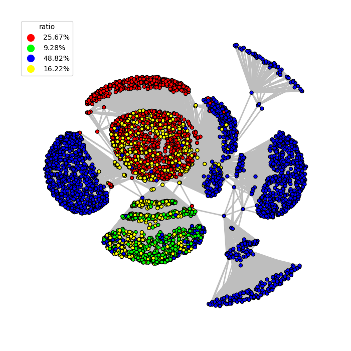
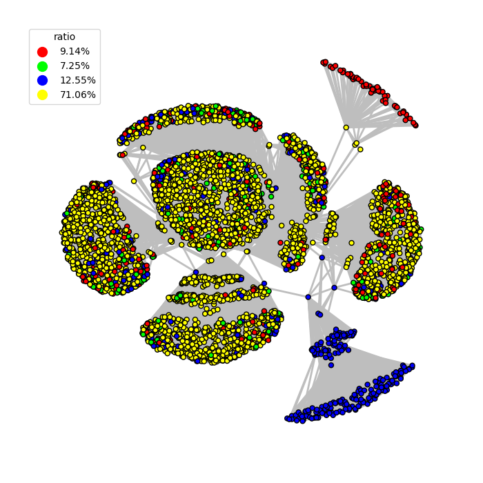
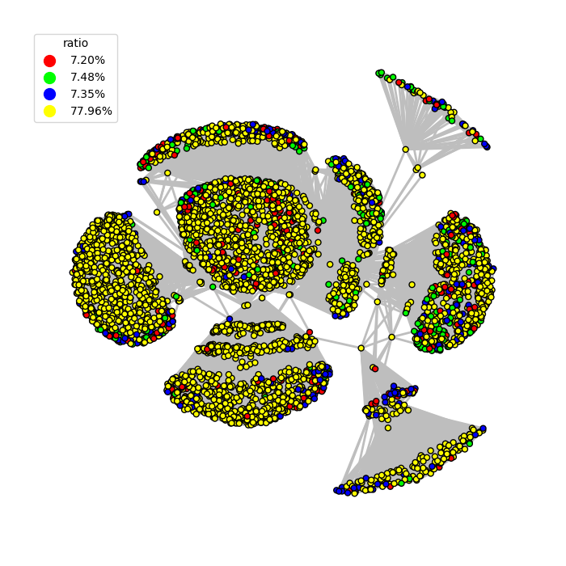
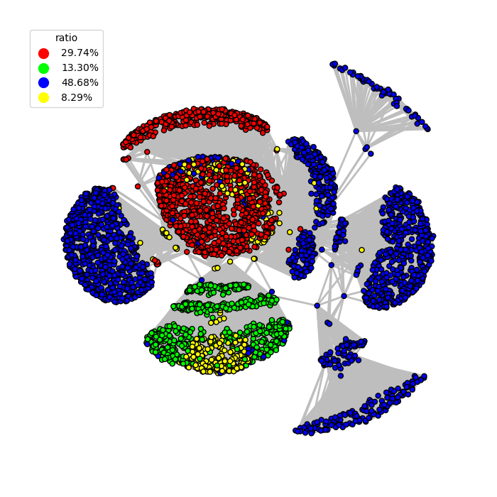
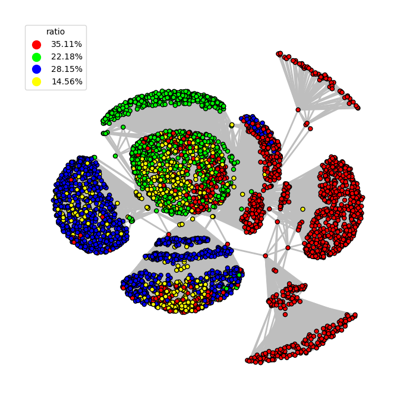

FSM A Fine-grained Splitting and Merging Framework for Dual-balanced Graph Partition
=============================================

## Visualization

Here we use different algorithms to partition [ego-facebook](httpssnap.stanford.edudataego-Facebook.html) into 3 parts (edge partition, e.g., each edge is assigned to a part).
We use `red, green and blue` to denoted the vertices that only belong to exactly one part.
For those vertices that lies on the boundary between multiple parts, we use `yellow` to denote them.
By default, the numbers of edges in different parts are close.
A `good` partition result should minimize the `yellow` vertice ratio and try to balance the `red, green and blue` ratio.


|   ne   |   2ps   |   hdrf   |
| :-: | :-: | :-: |
|       |      |      |

|   ebv   |   hep10   | **fsm_hep_k2** |
| :-: | :-: |  :-: |
|      |      |      |


## Compile

cmake, glog, gflags, boost are required

`sudo apt-get install libgoogle-glog-dev libgflags-dev libboost-all-dev`

```sh
mkdir build 
cd build
cmake ..
make -j4
```

## Run

### Prioritize Edge Balance

Run with FSM-H (HEP-100) k=2, p=32

```shell
.main -p 32 -k 2 -method fsm_hep -hdf 100 -filename ....dataset...
```

Run with FSM-N (NE) k=2, p=32

```shell
.main -p 32 -k 2 -method fsm_ne -filename ....dataset...
```

### Prioritize Vertex Balance

```shell
# -write true must be set
.main -p 8 -method fennel -filename ....datasethollywood-2011.txt -write true

.main -p 8 -method e2a -filename ....datasethollywood-2011.txt

.main -p 8 -method v2e_fennel -filename ....datasethollywood-2011.txt
```

### Partition with METIS

```shell
.main -method e2a -filename ....datasethollywood-2011.txt
gpmetis ....datasethollywood-2011.txt.adjlist 8 -objtype=vol
mv ....datasethollywood-2011.txt.adjlist.part.8 ....datasethollywood-2011.txt.vertexpart.metis.8
.main -method v2e_metis -p 8 -filename ....datasethollywood-2011.txt
```


If you want to write the partition, please add `-write true` to the command.

If you want to merge with Fast Merge, please add `-fastmerge true` to the command.

## Dataset

### SNAP and Networkrepository

[SNAP](httpsnap.stanford.edudataindex.html)
[Networkrepository](httpsnetworkrepository.comnetworks.php)

### Webgraph
We prepare a sript for Webgraph environment setup. Run `setup_webgraph.sh` in `dataset` folder. 
Then you can download `{graphname}.graph` and `{graphname}.properties` from [webgraph](httpslaw.di.unimi.itdatasets.php). 

Take indochina graph as an example

```shell
cd datasetwebgraph

wget httpdata.law.di.unimi.itwebdataindochina-2004indochina-2004.graph
wget httpdata.law.di.unimi.itwebdataindochina-2004indochina-2004.properties
```

Use `java -cp webgraph_dep it.unimi.dsi.webgraph.ArcListASCIIGraph indochina-2004 indochina-2004.txt` to get final graph. 

## FAQ

Q1 Why it fails on `.main -p 16 -method fsm_hep -hdf 100 -k 4 -filename ..datasetsnapemail-Enron.txt` with hep_partitioner.hpp76] Check failed edge2bucket[edge_id] == -1 (17 vs. -1)   
 In the Split Phase, HEP sample vertices in a sequential way. 
 Instead, NE sample randomly so that it might partition smoothly. 

Q2 Why it takes so long for `-method ne` to partition a large graph under `-p 512` 
 When NE is close to finish, it needs to pull vertices into boundary in a random way much more frequently. However, it might take a long time to lottery a valid vertex. 
 HEP can avoid this phenomenon in a certain degree. 